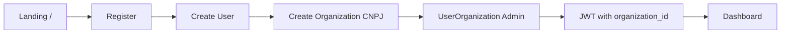
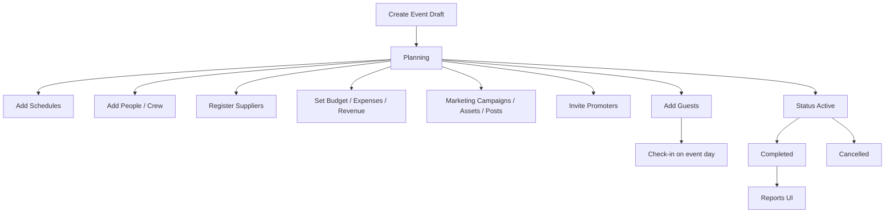
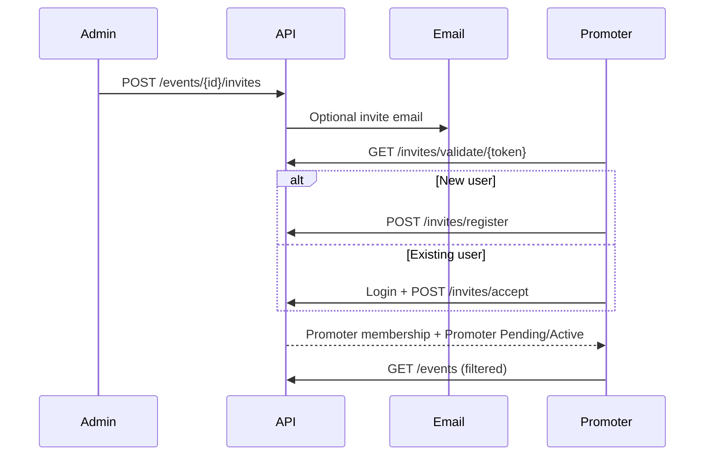
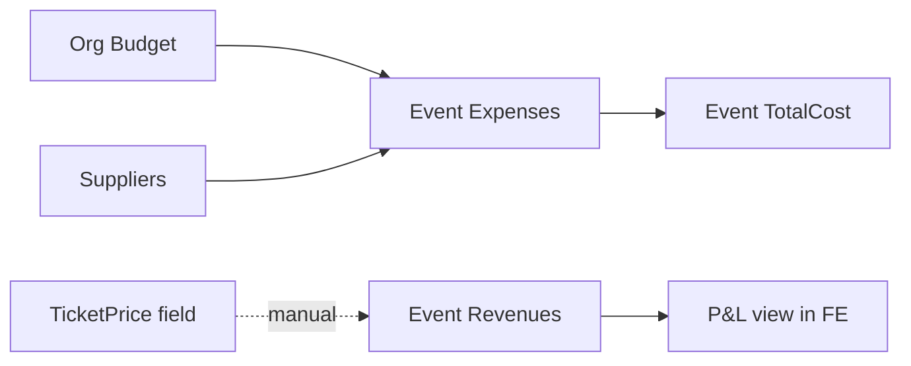
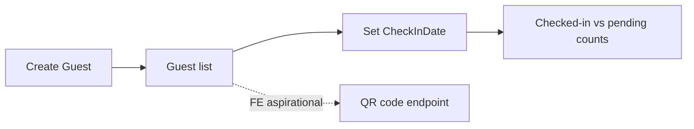

# Pulse8 — Product Strategy Analysis

**Document type:** Reverse-engineered product analysis (not a code review)  
**Sources:** `pulse8` (.NET 8 backend), `pulse8front` (Next.js frontend)  
**Date:** 2026-07-30  
**Method:** Evidence from entities, APIs, screens, navigation, docs, and SQL leftovers. Inferences are labeled explicitly.

---

## Evidence Map (quick reference)

| Area | Primary evidence |
|------|------------------|
| Product positioning | `pulse8/README.md`, `pulse8front/README.md`, `src/app/page.tsx`, `RESUMO_EXECUTIVO.md` |
| Domain model | `Pulse8.Domain/Entities/*` (17 entities) |
| APIs | `Pulse8.API/Controllers/*` |
| Roles | `UserOrganizationType` (Admin/Manager/Employee/Promoter), `sidebar.tsx` |
| Brazilian market | `Organization.Cnpj`, CEP/UF validators, PIX keys, PT-BR UI |
| SaaS pricing (marketing only) | Landing pricing cards in `src/app/page.tsx` — no Subscription entity/API |
| Planned but missing | `create_missing_tables_v2.sql` comments; FE calls to `/roles`, `/access`, `/guests/{id}/qr-code` with no BE controllers |

---

# PHASE 1 — Understand the Product

## Product Summary

Pulse8 is a **B2B event-production operations platform** for Brazilian organizers. It lets a production company (Organization with CNPJ) manage events end-to-end inside one authenticated console: create events, assign crew (People), invite promoters, manage guests/check-in, track budgets/expenses/revenues, schedule agenda items, register suppliers, and run basic marketing campaigns/posts/assets.

It is **not** a consumer ticket marketplace, not a public RSVP storefront, and not a supplier marketplace. The public surface is thin: marketing landing (`/`), auth, and promoter invite links (`/invite/[token]`).

## Main Purpose

Centralize day-to-day **event ops** for a producing organization:

1. Plan and run events (status lifecycle Draft → Planning → Active → Completed/Cancelled)
2. Coordinate people around those events (team, promoters, guests, suppliers)
3. Track money (org budgets + event expenses/revenues)
4. Support promotion (campaigns, posts, promoter codes/UTM/commissions)

## Target Users (as implemented)

Primary: **Event-producing companies in Brazil** (register with CNPJ, CEP, UF).

Secondary: **Promoters** invited to specific events (restricted UI: events + change password).

Tertiary (weak/partial): internal staff via membership types Manager/Employee — defined in domain, barely differentiated in product behavior.

## Core Value Proposition

> “One Portuguese-language console where a Brazilian event producer manages events, guests, crew, suppliers, promoter network, marketing artifacts, and event P&L — without juggling spreadsheets and WhatsApp.”

**Investor pitch (evidence-based):**

Pulse8 targets the fragmented Brazilian event production stack. Organizers today coordinate guests, promoters, suppliers, and cashflow across spreadsheets, Instagram DMs, and WhatsApp. Pulse8’s distinctive wedge is the **promoter invite + commission/UTM model** layered onto classic event ops (finance, guests, schedules, suppliers). The product already ships a broad UI surface (~96 pages) and a Clean Architecture .NET API covering the core aggregates. Monetization intent is visible on the landing page (Starter R$99 / Professional R$299 / Enterprise Custom), but **billing is not implemented in the backend** — this is inferred because no Subscription/Plan/Payment entities or controllers exist, while pricing only appears in `src/app/page.tsx`.

---

# PHASE 2 — Identify the Users

Legend for “how Pulse8 helps”: based on actual modules. “Missing” means no entity/API/screen evidence, or UI exists without backend.

## 1. Event Producer / Production Company Admin

| Dimension | Assessment |
|-----------|------------|
| **Goals** | Run profitable events; control guests, money, team, suppliers |
| **Pains** | Fragmented tools; promoter chaos; weak financial visibility |
| **How Pulse8 helps** | Full sidebar access: Events, Finance, Calendar, Marketing, Team, Promoters, Guests, Suppliers, Reports, Admin (`sidebar.tsx`) |
| **Missing** | Contracts, proposals, CRM clients, ticketing checkout, approvals, real RBAC beyond Admin/Promoter |

## 2. Promoter

| Dimension | Assessment |
|-----------|------------|
| **Goals** | Sell/promote events; track commissions; get invites easily |
| **Pains** | Opaque attribution; manual commission tracking |
| **How Pulse8 helps** | Invite token flow (`EventInvite`, `/invite/[token]`); `Promoter` with PromoterCode, UTMCode, CommissionRate, TotalSales, TotalCommission; restricted nav |
| **Missing** | Self-serve sales dashboard with real sales ingestion; payout/PIX settlement; public share landing with conversion tracking; promoter mobile app |

## 3. Production Team / Employee / Manager

| Dimension | Assessment |
|-----------|------------|
| **Goals** | Execute schedules, manage guests, update expenses |
| **Pains** | Unclear permissions; overlapping tools |
| **How Pulse8 helps** | Membership types Manager/Employee exist (`UserOrganizationType`); team via `Person`/`/people` |
| **Missing** | Role-differentiated menus for Manager vs Employee (only Promoter is filtered in `sidebar.tsx`). This is inferred because FE docs claim 5 roles while BE has 4 membership types with thin enforcement. |

## 4. Guest / Attendee

| Dimension | Assessment |
|-----------|------------|
| **Goals** | Receive invite, check in |
| **Pains** | No self-service |
| **How Pulse8 helps** | Staff-managed `Guest` records + `CheckInDate` |
| **Missing** | Guest portal, RSVP, e-ticket purchase, QR backend (`guests.ts` calls `/guests/{id}/qr-code` but no Guests QR endpoint in BE controllers). Guest types VIP/Press/etc. appear in FE types/docs but not on BE `Guest` entity. |

## 5. Supplier / Vendor

| Dimension | Assessment |
|-----------|------------|
| **Goals** | Be hired, get paid |
| **Pains** | No portal; no proposals |
| **How Pulse8 helps** | Org-scoped supplier CRM-lite (`Supplier` with PIX/bank) linked to expenses |
| **Missing** | Supplier portal, RFPs/proposals (`SupplierProposals` only in SQL comments), inventory, availability calendar |

## 6. Venue

| Dimension | Assessment |
|-----------|------------|
| **Supported?** | Partially as event location fields + ExpenseType.Venue |
| **Missing** | Venue as actor/tenant; room inventory; booking engine |

## 7. DJ / Artist / Artist Manager

| Dimension | Assessment |
|-----------|------------|
| **Supported?** | Weak — can be modeled as `Person.Role` free text or Guest type in FE |
| **Missing** | Rider management, performance schedule contracts, artist CRM, fee settlements |

## 8. Sound / Lighting / Stage / Security / Bar / Catering Companies

| Dimension | Assessment |
|-----------|------------|
| **Supported?** | As `Supplier` + expense categories (`ExpenseType`) |
| **Missing** | Vertical workflows, equipment inventory, crew call sheets, SLAs |

## 9. Photographer / Videographer / Decorator

| Dimension | Assessment |
|-----------|------------|
| **Supported?** | Supplier or Person only |
| **Missing** | Asset delivery workflows, shot lists, rights management (MarketingAsset is org/event file metadata, not creative production workflow) |

## 10. Wedding Planner / Corporate Planner / Festival Organizer

| Dimension | Assessment |
|-----------|------------|
| **Supported?** | Generic Event ops can partially fit |
| **Missing** | Wedding-specific (vendors packages, seating), corporate (registration, badge printing, sessions), festival (multi-stage, artist lineup, accreditation) |

## 11. Sponsor / Financial Manager

| Dimension | Assessment |
|-----------|------------|
| **Supported?** | Revenue source free text (e.g. “Patrocínio” placeholder in FE); Budget/Expense/Revenue modules |
| **Missing** | Sponsor packages, deliverables, invoice issuance (only `InvoiceNumber` on Expense), accounting integrations, multi-currency |

## 12. Freelancer / Solo Professional

| Dimension | Assessment |
|-----------|------------|
| **Supported?** | Can register org (heavy for solo) or join as promoter/person |
| **Missing** | Lightweight solo plan enforcement, personal brand site, client invoicing |

---

# PHASE 3 — Feature Catalog by Domain

Status key: **Real** = BE entity + API + FE screen; **UI-heavy** = FE exists, BE partial/missing; **Marketing-only** = claimed on landing/docs without runtime enforcement.

## Domain: Identity & Tenancy

| Feature | Purpose | Who | Business value | Dependencies | Screens | APIs |
|---------|---------|-----|----------------|--------------|---------|------|
| Register org + admin | Bootstrap tenant | Producer | Acquisition | Org uniqueness (CNPJ) | `/register` | `POST /api/auth/register` |
| Login / JWT | Session | All users | Access control | User + UserOrganization | `/login` | `POST /api/auth/login`, `GET /me` |
| Google/Instagram OAuth | Frictionless auth | All | Conversion | OAuth config | login/register/IG callback | `/api/auth/oauth/*` |
| Multi-org membership | User in many orgs | Power users | Flexibility | UserOrganization | login org picker | `/api/userorganizations` |
| Forgot/change password | Account recovery | All | Support | Email (SendGrid/SMTP) | `/forgot-password`, `/admin/change-password` | forgot/change-password |

## Domain: Events

| Feature | Purpose | Who | Value | Deps | Screens | APIs |
|---------|---------|-----|-------|------|---------|------|
| Event CRUD | Core aggregate | Admin/staff | Core | Organization | `/events/*` | `/api/events` |
| Status lifecycle | Ops stages | Producer | Process control | EventStatus enum | event form/detail | create/update event |
| TicketPrice field | Price reference | Producer | Pricing intent | Event | event form | Event DTO |
| Capacity / location | Planning | Producer | Logistics | Event | event form | Event DTO |
| Promoter event filter | Scope visibility | Promoter | Security/UX | Promoter join | `/events` | GetEventsQueryHandler |

## Domain: Promoters & Invites

| Feature | Purpose | Who | Value | Deps | Screens | APIs |
|---------|---------|-----|-------|------|---------|------|
| Create invite (email or shareable) | Recruit promoters | Admin | Growth network | EventInvite, email | event detail invites | `/api/events/{id}/invites` |
| Validate/accept/register via token | Onboard promoters | Promoter | Viral acquisition | InvitesController | `/invite/[token]` | `/api/invites/*` |
| Promoter codes / UTM / commission | Attribution | Producer/Promoter | Performance marketing | Promoter entity | `/promoters/*` | `/api/promoters` |

## Domain: Guests & Check-in

| Feature | Purpose | Who | Value | Deps | Screens | APIs |
|---------|---------|-----|-------|------|---------|------|
| Guest CRUD | Attendance list | Staff | Door control | Guest | `/guests/*` | `/api/guests` |
| Check-in via CheckInDate | Door ops | Staff | Day-of execution | Guest | `/guests/checkin/*` | guest update/list counts |
| QR codes | Fast check-in | Staff | UX | **Missing BE** | guest detail | FE `POST /guests/{id}/qr-code` — **no BE controller** |
| Guest types (VIP/Press…) | Segmentation | Staff | Hospitality | **FE-only types** | guests UI | not on BE Guest |

## Domain: Team (People)

| Feature | Purpose | Who | Value | Deps | Screens | APIs |
|---------|---------|-----|-------|------|---------|------|
| People CRUD | Crew roster | Producer | Staffing | Person (Role free text, PIX) | `/team/*` | `/api/people` |
| Team roles/cargos pages | Job titles | Producer | Structure | **Likely FE-only** | `/team/roles/*` | FE `/roles` — **no RolesController in BE** |

## Domain: Suppliers

| Feature | Purpose | Who | Value | Deps | Screens | APIs |
|---------|---------|-----|-------|------|---------|------|
| Supplier CRM-lite | Vendor registry | Producer | Procurement | Supplier + PIX/bank | `/suppliers/*` | `/api/suppliers` |
| Link supplier to expense | Cost attribution | Finance | Traceability | Expense.SupplierId | expense forms | `/api/finance/expenses` |

## Domain: Calendar / Schedules

| Feature | Purpose | Who | Value | Deps | Screens | APIs |
|---------|---------|-----|-------|------|---------|------|
| Schedule CRUD | Event agenda | Staff | Production timeline | Schedule | `/calendar/schedules/*` | `/api/schedule` |
| Calendar / Timeline views | Visualization | Staff | Planning UX | schedules (+ mock calendar events) | `/calendar`, `/calendar/timeline` | schedule APIs + FE mock helpers |

## Domain: Financial

| Feature | Purpose | Who | Value | Deps | Screens | APIs |
|---------|---------|-----|-------|------|---------|------|
| Org budgets | Planned spend | Producer/Finance | Control | Budget | `/finance/budget/*` | `/api/budget` |
| Event expenses | Cost tracking | Finance | P&L | Expense + types | `/finance/expenses/*` | `/api/finance/expenses` |
| Event revenues | Income tracking | Finance | P&L | Revenue | `/finance/revenue/*` | `/api/finance/revenue` |
| Expense invoice number | Reference | Finance | Audit trail lite | Expense.InvoiceNumber | expense forms | expense DTOs |
| Ticket sales as revenue | Manual recording | Finance | Close books | free-text Source | revenue create placeholders | revenue APIs |

## Domain: Marketing

| Feature | Purpose | Who | Value | Deps | Screens | APIs |
|---------|---------|-----|-------|------|---------|------|
| Campaigns | Promo planning | Marketing | Demand gen | MarketingCampaign | `/marketing/campaigns/*` | `/api/marketing` |
| Posts | Content calendar | Marketing | Execution | MarketingPost | `/marketing/posts/*`, schedules | `/api/marketing/posts` |
| Assets | Creative library | Marketing | Reuse | MarketingAsset (path metadata) | `/marketing/assets/*` | `/api/marketing/assets` |
| Social publishing | Auto-post | Marketing | Efficiency | **Not integrated** — status enum only; no Meta/TikTok publish API |

## Domain: Reports & Analytics

| Feature | Purpose | Who | Value | Status |
|---------|---------|-----|-------|--------|
| Reports hub pages | Insights | Producer | Decision support | **UI-heavy** — pages under `/reports/*`; no dedicated ReportsController in BE |
| Dashboard KPIs | Overview | Admin | At-a-glance | FE dashboard; promoter redirected to `/events` |

## Domain: Admin / Security / Settings

| Feature | Purpose | Who | Status |
|---------|---------|-----|--------|
| Users CRUD | Staff accounts | Admin | Real-ish via `/api/users` |
| Roles & permissions UI | Fine-grained RBAC | Admin | **UI/mock** — docs claim 5 roles; BE has membership enum; FE `/roles` & `/access` have **no BE controllers** |
| Integrations page | Stripe, Mailchimp, etc. | Admin | **Marketing/mock UI** in settings |
| Backup page | Ops | Admin | **UI-only** (no BE backup API found) |
| SaaS plan limits | Monetization | Platform | **Marketing-only** on landing |

## Domain: Communication

| Feature | Purpose | Status |
|---------|---------|--------|
| Invite emails | Promoter onboarding | Real (SendGrid/SMTP) |
| Password recovery email | Auth | Real |
| In-app notifications | Ops alerts | Header notifications commented out |
| WhatsApp / SMS | Channel | Listed on integrations UI only |

---

# PHASE 4 — Complete Workflows

## 4.1 Organization Onboarding

Evidence: `RegisterCommandHandler`, `/register` stepper.

## 4.2 Event Production Lifecycle (as supported today)

**Gaps in classic industry flow:** Lead → Client → Proposal → Contract → Ticket Sales checkout → Automated closing are **missing** (no Client/Contract/Proposal/TicketOrder entities).

## 4.3 Promoter Invite Journey (strongest distinctive workflow)

## 4.4 Finance Loop

Ticket sales are **manual revenue entries**, not a sales engine. This is inferred because `TicketPrice` is a scalar on Event and Revenue.Source is free text; there is no Order/Payment entity.

## 4.5 Guest Check-in

## 4.6 Missing aspirational CRM→Contract flow

Red nodes have **no domain entities** — believed missing because grep/entity scan found none; SQL comments mention SupplierProposals/Permissions but not Client/Contract modules.

---

# PHASE 5 — Business Model

## Problem being solved

Brazilian event producers lack a localized ops system that combines **event execution + promoter networks + PIX-friendly vendor/crew data + PT-BR UX**. Tools are either generic PM (Monday/ClickUp), foreign event suites (Cvent), or consumer ticketing (Eventbrite/Sympla) that don’t run backstage ops.

## Why someone would pay

1. Replace spreadsheets for guests, expenses, suppliers
2. Coordinate promoters with invite links and commission fields
3. Keep event P&L in one place
4. Portuguese + CNPJ/PIX-native data model

**Willingness-to-pay is asserted by landing pricing** (R$99 / R$299 / Custom) but **not enforced by metering** — inferred because no plan limits exist in API/handlers.

## Competitive advantages (current)

| Advantage | Evidence |
|-----------|----------|
| Promoter invite network | EventInvite + Promoter commissions/UTM |
| Brazil-first data model | CNPJ, CEP, UF, PIX keys, PT-BR UI |
| Broad ops surface in one app | 12 module areas in sidebar |
| Event-scoped multi-sided users | Organizer vs Promoter experiences |

## Weak points

| Weak point | Why we believe it |
|------------|-------------------|
| Commercial engine absent | No subscriptions, payments, entitlements |
| Frontend ahead of backend | Roles, access logs, QR, many reports/integrations mocked |
| Thin authorization | README admits inconsistent org isolation; most controllers lack `[Authorize]` |
| No ticketing / registration product | TicketPrice only; no checkout |
| No contracts/CRM | No Client/Contract entities |
| Marketing automation incomplete | Posts have statuses; no social APIs |
| Docs overclaim maturity | `RESUMO_EXECUTIVO.md` says 5 permission levels & complete modules; runtime contradicts |

---

# PHASE 6 — Market Fit by Segment

| Segment | Support | Required features | Priority (1–10) |
|---------|---------|-------------------|-----------------|
| **Event Producers (BR parties/shows)** | **Supported today** (core ICP) | Harden auth, reports, promoter sales truth | 10 |
| **Event Agencies** | **Partial** | Multi-client CRM, proposals, contracts, multi-brand | 9 |
| **DJs / Solo entertainers** | **Partial / weak** | Lightweight workspace, gig calendar, contracts, payouts | 6 |
| **Wedding Planners** | **Partial** | Vendor packages, seating, client portal, checklists | 7 |
| **Concert Producers** | **Partial** | Artist lineup, riders, settlements, accreditation | 8 |
| **Music Festivals** | **Missing / thin** | Multi-stage, zones, artist mgmt, volunteer, cashless | 5 |
| **Corporate Events** | **Partial** | Registration, badges, sessions, compliance, SSO | 7 |
| **Venues** | **Missing as persona** | Space inventory, holds, BEOs, venue portal | 6 |
| **Equipment Rental** | **Missing** | Inventory, availability, damage, delivery | 5 |
| **Sound / Lighting / Stage Cos** | **Partial as Supplier** | Job sheets, crew, gear lists | 6 |
| **Security Companies** | **Partial as Supplier** | Post orders, incident logs | 4 |
| **Catering / Bar** | **Partial as Supplier + ExpenseType** | Menus, headcount F&B, inventory | 5 |
| **Photographers / Videographers** | **Partial as Supplier** | Shot lists, galleries, rights | 4 |
| **Decorators** | **Partial as Supplier** | Moodboards, install schedules | 3 |
| **Freelancers** | **Partial** | Solo UX, invoicing | 6 |
| **Small Teams** | **Supported today** | Reliability, mobile check-in | 9 |
| **Large Enterprises** | **Missing** | SSO, audit, RBAC, SLA, multi-entity finance | 4 |
| **Sponsors** | **Missing** | Packages, ROI reporting | 3 |

---

# PHASE 7 — Competitive Capability Gap

Comparison is **capability**, not UI.

| Capability | Pulse8 | Monday/Asana/ClickUp | Eventbrite | Cvent/Bizzabo/Whova | Notion/Airtable |
|------------|--------|----------------------|------------|---------------------|-----------------|
| Generic PM/tasks | Weak/Missing | Strong | Weak | Medium | Strong |
| Event object model | Strong | Weak | Strong | Strong | DIY |
| Guest registration | Partial (staff list) | No | Strong | Strong | DIY |
| Ticketing/payments | Missing | No | Strong | Strong | No |
| Promoter/affiliate network | **Strong niche** | No | Partial | Partial | DIY |
| Event finance P&L | Medium | Weak | Partial | Medium | DIY |
| Supplier CRM | Basic | Weak | No | Medium | DIY |
| Marketing campaigns | Basic CRUD | Weak | Medium | Medium | DIY |
| Contracts | Missing | Weak | No | Medium | DIY |
| Mobile check-in | Partial (web) | No | Strong | Strong | No |
| Enterprise RBAC/SSO | Missing | Strong | Medium | Strong | Medium |
| Brazil PIX/CNPJ native | **Strong** | Weak | Partial (local players differ) | Weak | Weak |
| Workflow engine | Missing | Medium | Weak | Medium | DIY |
| Marketplace | Missing | No | Weak | No | No |

### Strong modules
- Events core
- Promoter invites + attribution fields
- Org tenancy skeleton
- Expense/Revenue/Budget basics
- Brazil-oriented onboarding

### Weak modules
- Reports/analytics (pages without analytics API)
- Admin RBAC (mock/docs vs reality)
- Marketing automation (no publish integrations)
- Calendar (visualizations over thin Schedule model)
- Settings/integrations (catalog UI)

### Missing modules
- Ticketing & payments
- CRM (Leads/Clients)
- Contracts & e-sign
- Tasks/approvals/workflow engine
- Inventory/equipment
- Vendor marketplace
- Client/guest portals
- SaaS billing & entitlements
- Mobile apps
- AI/automation agents

### Competitive advantages to double down on
1. **Promoter OS for Brazilian nightlife/events**
2. **Ops + money in one PT-BR product**
3. **Invite-led multi-sided network effects**

---

# PHASE 8 — Product Strategy Roadmap

## MVP (stabilize the wedge)

**Scope:** Make the producer + promoter loop production-reliable.

- Enforce auth + org isolation on every API
- Finish guest check-in (including real QR)
- Promoter dashboard with editable commission truth and basic sales entry
- Event finance summary that is trustworthy
- Kill or clearly label mock admin/integrations/reports
- Implement actual Starter metering OR remove fake plan limits from marketing until real

**Why:** Trust before expansion. Today UI breadth > backend truth.  
**Impact:** Convertable pilots with BR producers.  
**Complexity:** Medium (security + gap closure).  
**Business value:** Unlocks paid pilots.

## Version 1.0 (sellable SaaS for producers)

- Subscription billing (Stripe/Pagar.me) + plan entitlements
- Real RBAC (Admin/Manager/Employee/Promoter policies)
- Reports API (event, financial, guest, promoter performance)
- Mobile-friendly check-in PWA
- Email/WhatsApp notify for invites
- File storage for assets (S3-compatible)
- Audit log (SQL already envisioned)

**Why:** Commercial readiness.  
**Impact:** Recurring revenue.  
**Complexity:** High.  
**Business value:** High — matches landing promise.

## Version 2.0 (category expansion)

- Client CRM + proposals
- Contracts / e-sign
- Ticketing or deep Sympla/Eventbrite sync
- Supplier portal + proposals
- Tasking & production checklists
- Marketing publish integrations (Meta/IG)

**Why:** Move from “ops notebook” to “agency OS”.  
**Impact:** Larger ACV (agencies).  
**Complexity:** Very high.  
**Business value:** Expands ICP beyond parties/promoters.

## Version 3.0 (ecosystem / OS ambitions)

- Vendor marketplace
- Partner API platform
- White-label venue/agency
- AI agents (budget advisor, promoter scoring, schedule builder)
- Workflow engine
- Multi-vertical templates (wedding, corporate, festival)

**Why:** Platform compounding.  
**Impact:** Network effects.  
**Complexity:** Extreme.  
**Business value:** Venture-scale — only after V1 retention is proven.

---

# PHASE 9 — Product Vision & Positioning

## What it is today

A combination of:

- **Event operations tool** (primary)
- **Light financial tracker**
- **Light CRM** (people/guests/suppliers)
- **Promoter affiliate module**
- **Marketing asset/campaign notebook**

It is **not yet** an ERP, marketplace, full CRM, or industry OS.

## Recommended positioning

> **“The operating system for Brazilian event producers and their promoter networks.”**

Do **not** position as “Cvent for everything” yet. Win one wedge:

1. Nightlife / shows / club events producers + promoters  
2. Then agencies  
3. Then vertical templates  

Avoid spreading into venue ERP + ticketing + marketplace simultaneously before V1 monetization.

---

# PHASE 10 — SaaS Scalability Assessment

| Capability | Status | Evidence / inference |
|------------|--------|----------------------|
| Multi-tenancy | **Partial** | Organization as tenant + JWT `organization_id`; README warns isolation inconsistent |
| Subscription plans | **Missing (marketing only)** | Landing prices; no Plan entity |
| White Label | **Missing** | No branding/tenant theme engine beyond basic theme toggle |
| Large companies | **Weak** | No SSO, weak RBAC, no audit productization |
| Small businesses | **Good fit** | Org register + broad simple CRUD |
| Solo professionals | **Awkward** | Forced into Organization/CNPJ model |
| Marketplace | **Missing** | No listings/transactions between orgs |
| Partner ecosystem | **Missing** | No public partner API program |
| API Platform | **Early** | REST + Swagger exist; not productized for 3rd parties |
| Mobile App | **Missing** | Responsive web only |
| AI Agents | **Missing** | No AI features found |
| Automation | **Missing** | No rules engine; post scheduling statuses only |
| Workflow Engine | **Missing** | Status enums only, not configurable workflows |

---

# PHASE 11 — Product Scores (1–10)

| Dimension | Score | Explanation |
|-----------|------:|-------------|
| **Product Vision** | **6** | Clear event-ops vision in README/landing; OS ambition implied but not operationalized. |
| **Market Fit** | **5** | Strong conceptual fit for BR producers/promoters; many segments unsupported; billing/ticketing gaps hurt fit. |
| **Feature Completeness** | **4** | Wide FE surface; several modules mock/partial; core CRUD exists; industry workflows incomplete. |
| **Usability** | **6** | Coherent PT-BR nav and forms; promoter-restricted UX shows product thinking; dead-end mock screens hurt trust. |
| **Scalability** | **4** | Org tenancy skeleton OK; auth/isolation/billing/tests/migrations gaps (README production-readiness section). |
| **Business Potential** | **7** | Large BR/LATAM event market + promoter wedge could work if focused; monetization path visible. |
| **Competitive Position** | **4** | Differentiated on promoter+Brazil niche; loses to specialists on ticketing/enterprise/PM depth. |
| **Technical Foundation** | **6** | Clean Architecture .NET 8 + Next.js is a solid base; incomplete security/tests reduce score. |
| **Overall Product** | **5** | Promising early-stage ops platform with a real wedge; not yet a coherent commercially ready product. |

---

# PHASE 12 — Executive Report

## Executive Summary

Pulse8 is an early-stage **event production operations SaaS** aimed at Brazilian organizers, with a distinctive **promoter invitation and commission** workflow. The frontend presents a full suite (12 modules, ~96 routes); the backend implements solid CRUD for core aggregates (Organization, Event, Guest, Person, Supplier, Schedule, Budget, Expense, Revenue, Marketing*, Promoter, Invite) but **does not yet support** subscriptions, contracts, ticketing, marketplace, fine-grained RBAC, or several APIs the frontend already calls. The product deserves investment **only if** it narrows to the producer–promoter wedge, closes trust gaps, and ships real billing — not if it continues expanding UI toward an “everything OS” narrative.

## Product Description

Authenticated multi-tenant web app where an Organization manages Events and related operational data, and can invite Promoters into event-scoped participation. Public pages cover marketing, auth, and invite acceptance.

## Target Market

Primary: Brazilian event production companies (CNPJ) running parties, shows, and mid-size events that rely on promoter networks.

## Ideal Customer Profile (ICP)

- 3–30 person production company in Brazil  
- Runs recurring ticketed or invite events  
- Uses promoters heavily  
- Needs guest list + basic P&L + supplier contacts  
- Currently lives in Sheets + WhatsApp + Instagram  

## Current Capabilities

- Org/user auth including Google/Instagram OAuth  
- Event lifecycle management  
- Guests + check-in field  
- Team (People), Suppliers  
- Budgets, Expenses, Revenues  
- Schedules  
- Marketing campaigns/posts/assets (CRUD)  
- Promoter invites + commission/UTM fields  
- Promoter-restricted UX  

## Missing Opportunities

1. True promoter performance / sales capture  
2. Ticketing or Sympla/Eventbrite integration  
3. CRM → Proposal → Contract  
4. SaaS billing aligned with landing plans  
5. Mobile check-in that works offline  
6. WhatsApp-native workflows (Brazil channel reality)

## Recommended Roadmap

MVP → V1.0 → V2.0 → V3.0 as in Phase 8. Near-term mantra: **narrow, harden, monetize**.

## Biggest Risks

1. **Trust gap** between marketed completeness and runtime reality  
2. **Security/tenancy debt** blocking real customers (README acknowledges)  
3. **Unfocused roadmap** chasing all event verticals  
4. **No payment rail** for SaaS or tickets  
5. **Competing with Sympla/Eventbrite** on ticketing before owning ops niche  

## Biggest Opportunities

1. Become the **Promoter Network OS** for Brazil  
2. Own backstage finance + guest ops adjacent to Sympla (integrate, don’t replace first)  
3. Template packs for agencies after V1 retention  
4. PIX-native supplier/crew payouts later  

## Strategic Recommendations

1. Reposition messaging from “plataforma completa” to “produção + promoters”.  
2. Create a public capability matrix: Real / Beta / Preview — stop mock screens silently failing.  
3. Instrument one beachhead vertical (nightlife/shows) with 10 design partners.  
4. Ship billing + entitlements before Enterprise claims.  
5. Treat promoter invite graph as the strategic moat.  

## Estimated Product Maturity

**Late prototype / early MVP** — breadth of screens suggests demo-ready; depth/security/monetization suggest not production-ready (aligned with backend README “not production-ready”).

## Commercial Readiness

**Low–Medium.** Landing CTA and price points exist; no metering, checkout, invoices, or customer lifecycle automation for the SaaS itself.

## Investment Readiness

**Conditional.** Investable as a **focused BR event-ops + promoters** thesis with a tight MVP plan. Not investable yet as “the all-in-one OS for the entire events industry” without multi-year platform build and clear wedge traction.

---

# Final Section — Could Pulse8 realistically become the all-in-one OS for the events industry?

**Honest founder answer: not with the current product shape, and not by continuing to widen the UI.**

### What is real today
Pulse8 is a credible seed of an **event operations console** with a smart local wedge (Brazilian orgs + promoter invites). That is enough to matter in a large market — if executed ruthlessly.

### What “OS for the events industry” actually requires
Ticketing or deep integrations, CRM, contracts, vendor marketplace, inventory, enterprise identity, workflow automation, vertical solutions (wedding/corporate/festival/venue), mobile, payments, and ecosystem APIs. Most of that is **absent** (believed missing due to no entities/controllers and FE mocks). Building all of it is a multi-product company, not a feature sprint.

### Decision framework
| Path | Verdict |
|------|---------|
| Expand horizontally to “OS for everyone” now | **No — high burn, low credibility** |
| Dominate BR producer + promoter ops, integrate ticketing, then expand modules | **Yes — plausible platform path** |
| Compete head-on with Cvent/Eventbrite globally | **No — wrong stage and scope** |

### Investment stance
**Further investment is justified** if the company commits to:

1. Beachhead ICP (BR producers using promoters)  
2. Closing backend/FE truth gaps and security  
3. Monetization in V1  
4. Saying “no” to marketplace/ERP fantasies until retention is proven  

Otherwise, the product risks becoming a wide demo with shallow workflows — impressive in screenshots (`RESUMO_EXECUTIVO.md` style claims), fragile in production.

**Bottom line:** Pulse8 can become *an* operating system for a **defined slice** of the events industry (Brazilian production teams and their promoter networks). Becoming *the* all-in-one OS for every segment listed in Phase 6 is not realistic from the current codebase without a decade-scale platform strategy and extreme focus discipline along the way.
