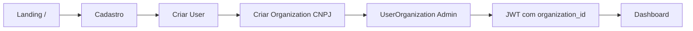
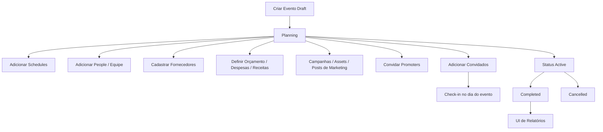
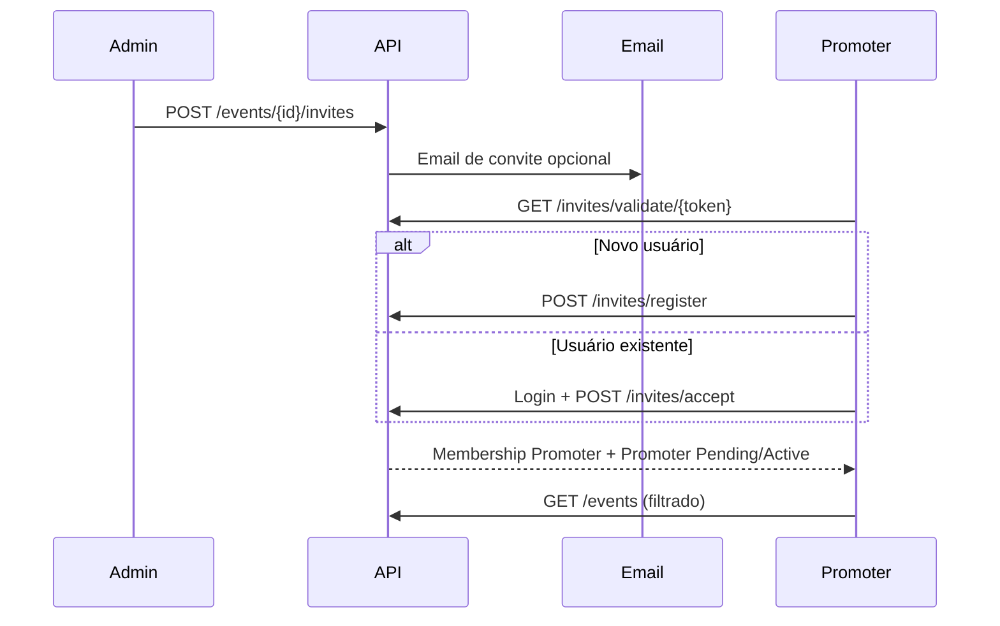
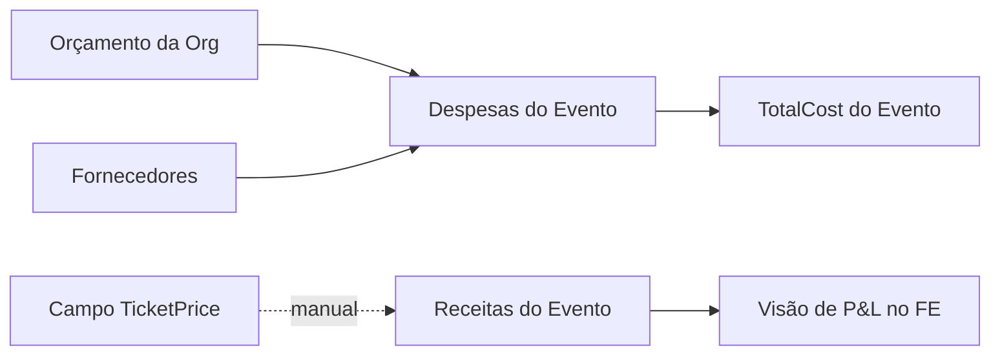
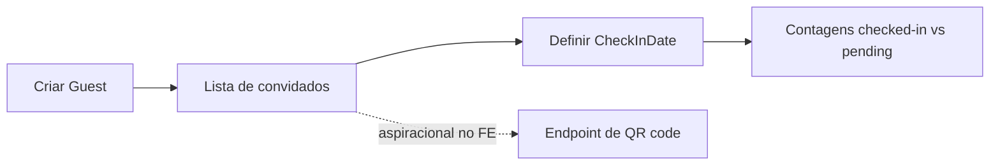

# Pulse8 — Análise de Estratégia de Produto

**Tipo de documento:** Análise de produto reverse-engineered (não é code review)  
**Fontes:** `pulse8` (backend .NET 8), `pulse8front` (frontend Next.js)  
**Data:** 2026-07-30  
**Método:** Evidências a partir de entidades, APIs, telas, navegação, documentação e resíduos SQL. Inferências são rotuladas explicitamente.

---

## Mapa de Evidências (referência rápida)

| Área | Evidência principal |
|------|---------------------|
| Posicionamento do produto | `pulse8/README.md`, `pulse8front/README.md`, `src/app/page.tsx`, `RESUMO_EXECUTIVO.md` |
| Modelo de domínio | `Pulse8.Domain/Entities/*` (17 entidades) |
| APIs | `Pulse8.API/Controllers/*` |
| Papéis | `UserOrganizationType` (Admin/Manager/Employee/Promoter), `sidebar.tsx` |
| Mercado brasileiro | `Organization.Cnpj`, validadores de CEP/UF, chaves PIX, UI em PT-BR |
| Preços SaaS (apenas marketing) | Cards de preço na landing em `src/app/page.tsx` — sem entidade/API de Subscription |
| Planejado, mas ausente | Comentários em `create_missing_tables_v2.sql`; chamadas FE para `/roles`, `/access`, `/guests/{id}/qr-code` sem controllers no BE |

---

# FASE 1 — Entender o Produto

## Resumo do Produto

O Pulse8 é uma **plataforma B2B de operações de produção de eventos** para organizadores brasileiros. Permite que uma empresa de produção (Organization com CNPJ) gerencie eventos de ponta a ponta em um único console autenticado: criar eventos, alocar equipe (People), convidar promoters, gerenciar convidados/check-in, acompanhar orçamentos/despesas/receitas, agendar itens de agenda, cadastrar fornecedores e operar campanhas/posts/assets básicos de marketing.

**Não é** um marketplace de ingressos para o consumidor final, nem um portal público de RSVP, nem um marketplace de fornecedores. A superfície pública é fina: landing de marketing (`/`), autenticação e links de convite para promoters (`/invite/[token]`).

## Propósito Principal

Centralizar as **operações diárias de eventos** de uma organização produtora:

1. Planejar e executar eventos (ciclo de status Draft → Planning → Active → Completed/Cancelled)
2. Coordenar pessoas em torno desses eventos (equipe, promoters, convidados, fornecedores)
3. Controlar dinheiro (orçamentos da org + despesas/receitas do evento)
4. Apoiar promoção (campanhas, posts, códigos de promoter/UTM/comissões)

## Usuários-Alvo (conforme implementado)

Primário: **Empresas produtoras de eventos no Brasil** (cadastro com CNPJ, CEP, UF).

Secundário: **Promoters** convidados para eventos específicos (UI restrita: eventos + alterar senha).

Terciário (fraco/parcial): equipe interna via tipos de membership Manager/Employee — definidos no domínio, quase sem diferenciação no comportamento do produto.

## Proposta de Valor Central

> “Um console em português onde um produtor brasileiro de eventos gerencia eventos, convidados, equipe, fornecedores, rede de promoters, artefatos de marketing e P&L do evento — sem depender de planilhas e WhatsApp.”

**Pitch para investidor (baseado em evidências):**

O Pulse8 mira a fragmentação da stack de produção de eventos no Brasil. Organizadores hoje coordenam convidados, promoters, fornecedores e fluxo de caixa entre planilhas, DMs do Instagram e WhatsApp. O diferencial do Pulse8 é o **modelo de convite de promoter + comissão/UTM** sobre operações clássicas de evento (financeiro, convidados, agendas, fornecedores). O produto já entrega uma superfície ampla de UI (~96 páginas) e uma API .NET em Clean Architecture cobrindo os agregados centrais. A intenção de monetização aparece na landing (Starter R$99 / Professional R$299 / Enterprise Custom), mas **a cobrança não está implementada no backend** — isso é inferido porque não existem entidades/controllers de Subscription/Plan/Payment, enquanto os preços só aparecem em `src/app/page.tsx`.

---

# FASE 2 — Identificar os Usuários

Legenda para “como o Pulse8 ajuda”: baseado nos módulos reais. “Ausente” significa sem evidência de entidade/API/tela, ou UI existe sem backend.

## 1. Produtor de Eventos / Admin da Empresa de Produção

| Dimensão | Avaliação |
|----------|-----------|
| **Objetivos** | Rodar eventos lucrativos; controlar convidados, dinheiro, equipe, fornecedores |
| **Dores** | Ferramentas fragmentadas; caos com promoters; pouca visibilidade financeira |
| **Como o Pulse8 ajuda** | Acesso completo à sidebar: Eventos, Financeiro, Calendário, Marketing, Equipe, Promoters, Convidados, Fornecedores, Relatórios, Admin (`sidebar.tsx`) |
| **Ausente** | Contratos, propostas, CRM de clientes, checkout de ingressos, aprovações, RBAC real além de Admin/Promoter |

## 2. Promoter

| Dimensão | Avaliação |
|----------|-----------|
| **Objetivos** | Vender/promover eventos; acompanhar comissões; receber convites com facilidade |
| **Dores** | Atribuição opaca; controle manual de comissões |
| **Como o Pulse8 ajuda** | Fluxo de token de convite (`EventInvite`, `/invite/[token]`); `Promoter` com PromoterCode, UTMCode, CommissionRate, TotalSales, TotalCommission; navegação restrita |
| **Ausente** | Dashboard self-serve com ingestão real de vendas; liquidação/PIX de payout; landing pública com tracking de conversão; app mobile do promoter |

## 3. Equipe de Produção / Funcionário / Gerente

| Dimensão | Avaliação |
|----------|-----------|
| **Objetivos** | Executar cronogramas, gerenciar convidados, atualizar despesas |
| **Dores** | Permissões pouco claras; ferramentas sobrepostas |
| **Como o Pulse8 ajuda** | Tipos Manager/Employee existem (`UserOrganizationType`); equipe via `Person`/`/people` |
| **Ausente** | Menus diferenciados por papel entre Manager e Employee (só Promoter é filtrado em `sidebar.tsx`). Isso é inferido porque a documentação do FE fala em 5 papéis, enquanto o BE tem 4 tipos de membership com enforcement fraco. |

## 4. Convidado / Participante

| Dimensão | Avaliação |
|----------|-----------|
| **Objetivos** | Receber convite, fazer check-in |
| **Dores** | Sem self-service |
| **Como o Pulse8 ajuda** | Registros `Guest` geridos pela staff + `CheckInDate` |
| **Ausente** | Portal do convidado, RSVP, compra de e-ticket, backend de QR (`guests.ts` chama `/guests/{id}/qr-code`, mas não há endpoint QR nos controllers do BE). Tipos VIP/Press/etc. aparecem em types/docs do FE, mas não na entidade `Guest` do BE. |

## 5. Fornecedor / Vendor

| Dimensão | Avaliação |
|----------|-----------|
| **Objetivos** | Ser contratado, receber pagamento |
| **Dores** | Sem portal; sem propostas |
| **Como o Pulse8 ajuda** | CRM-lite de fornecedores por org (`Supplier` com PIX/banco) ligado a despesas |
| **Ausente** | Portal do fornecedor, RFPs/propostas (`SupplierProposals` só em comentários SQL), inventário, calendário de disponibilidade |

## 6. Venue / Casa de Eventos

| Dimensão | Avaliação |
|----------|-----------|
| **Suportado?** | Parcialmente como campos de localização do evento + ExpenseType.Venue |
| **Ausente** | Venue como ator/tenant; inventário de salas; motor de booking |

## 7. DJ / Artista / Manager de Artista

| Dimensão | Avaliação |
|----------|-----------|
| **Suportado?** | Fraco — pode ser modelado como `Person.Role` (texto livre) ou tipo de Guest no FE |
| **Ausente** | Rider, contratos de cache, CRM de artistas, acertos financeiros |

## 8. Empresas de Som / Luz / Palco / Segurança / Bar / Catering

| Dimensão | Avaliação |
|----------|-----------|
| **Suportado?** | Como `Supplier` + categorias de despesa (`ExpenseType`) |
| **Ausente** | Fluxos verticais, inventário de equipamento, call sheets, SLAs |

## 9. Fotógrafo / Videógrafo / Decorador

| Dimensão | Avaliação |
|----------|-----------|
| **Suportado?** | Apenas como Supplier ou Person |
| **Ausente** | Fluxos de entrega de assets, shot lists, gestão de direitos (MarketingAsset é metadado de arquivo org/evento, não workflow criativo) |

## 10. Wedding Planner / Planejador Corporativo / Organizador de Festival

| Dimensão | Avaliação |
|----------|-----------|
| **Suportado?** | Ops genéricas de Event podem servir parcialmente |
| **Ausente** | Específicos de casamento (pacotes, seating), corporativo (credenciamento, badges, sessões), festival (multi-palco, lineup, credenciais) |

## 11. Patrocinador / Gestor Financeiro

| Dimensão | Avaliação |
|----------|-----------|
| **Suportado?** | Fonte de receita em texto livre (ex.: placeholder “Patrocínio” no FE); módulos Budget/Expense/Revenue |
| **Ausente** | Pacotes de patrocínio, entregáveis, emissão de NF/fatura (só `InvoiceNumber` em Expense), integrações contábeis, multi-moeda |

## 12. Freelancer / Profissional Solo

| Dimensão | Avaliação |
|----------|-----------|
| **Suportado?** | Pode cadastrar org (pesado para solo) ou entrar como promoter/person |
| **Ausente** | Plano leve para solo, site pessoal, faturamento de cliente |

---

# FASE 3 — Catálogo de Features por Domínio

Chave de status: **Real** = entidade BE + API + tela FE; **UI-pesado** = FE existe, BE parcial/ausente; **Apenas marketing** = prometido na landing/docs sem enforcement em runtime.

## Domínio: Identidade e Tenancy

| Feature | Propósito | Quem | Valor de negócio | Dependências | Telas | APIs |
|---------|-----------|------|------------------|--------------|-------|------|
| Cadastro org + admin | Bootstrap do tenant | Produtor | Aquisição | Unicidade de CNPJ | `/register` | `POST /api/auth/register` |
| Login / JWT | Sessão | Todos | Controle de acesso | User + UserOrganization | `/login` | `POST /api/auth/login`, `GET /me` |
| OAuth Google/Instagram | Auth com menos fricção | Todos | Conversão | Config OAuth | login/register/callback IG | `/api/auth/oauth/*` |
| Membership multi-org | Usuário em várias orgs | Power users | Flexibilidade | UserOrganization | seletor de org no login | `/api/userorganizations` |
| Esqueci/alterar senha | Recuperação de conta | Todos | Suporte | Email (SendGrid/SMTP) | `/forgot-password`, `/admin/change-password` | forgot/change-password |

## Domínio: Eventos

| Feature | Propósito | Quem | Valor | Deps | Telas | APIs |
|---------|-----------|------|-------|------|-------|------|
| CRUD de Evento | Agregado central | Admin/staff | Core | Organization | `/events/*` | `/api/events` |
| Ciclo de status | Etapas operacionais | Produtor | Controle de processo | Enum EventStatus | formulário/detalhe | create/update event |
| Campo TicketPrice | Referência de preço | Produtor | Intenção de pricing | Event | formulário | DTO de Event |
| Capacidade / local | Planejamento | Produtor | Logística | Event | formulário | DTO de Event |
| Filtro de eventos do promoter | Escopo de visibilidade | Promoter | Segurança/UX | Join Promoter | `/events` | GetEventsQueryHandler |

## Domínio: Promoters e Convites

| Feature | Propósito | Quem | Valor | Deps | Telas | APIs |
|---------|-----------|------|-------|------|-------|------|
| Criar convite (email ou compartilhável) | Recrutar promoters | Admin | Rede de crescimento | EventInvite, email | convites no detalhe do evento | `/api/events/{id}/invites` |
| Validar/aceitar/registrar via token | Onboarding de promoters | Promoter | Aquisição viral | InvitesController | `/invite/[token]` | `/api/invites/*` |
| Códigos / UTM / comissão | Atribuição | Produtor/Promoter | Performance marketing | Entidade Promoter | `/promoters/*` | `/api/promoters` |

## Domínio: Convidados e Check-in

| Feature | Propósito | Quem | Valor | Deps | Telas | APIs |
|---------|-----------|------|-------|------|-------|------|
| CRUD de Guest | Lista de presença | Staff | Controle de porta | Guest | `/guests/*` | `/api/guests` |
| Check-in via CheckInDate | Operação no dia | Staff | Execução | Guest | `/guests/checkin/*` | update/listagens com contagens |
| QR codes | Check-in rápido | Staff | UX | **BE ausente** | detalhe do convidado | FE `POST /guests/{id}/qr-code` — **sem controller no BE** |
| Tipos de convidado (VIP/Press…) | Segmentação | Staff | Hospitalidade | **Tipos só no FE** | UI de convidados | não está no Guest do BE |

## Domínio: Equipe (People)

| Feature | Propósito | Quem | Valor | Deps | Telas | APIs |
|---------|-----------|------|-------|------|-------|------|
| CRUD de People | Roster da equipe | Produtor | Staffing | Person (Role texto livre, PIX) | `/team/*` | `/api/people` |
| Páginas de cargos/roles | Títulos de função | Produtor | Estrutura | **Provavelmente só FE** | `/team/roles/*` | FE `/roles` — **sem RolesController no BE** |

## Domínio: Fornecedores

| Feature | Propósito | Quem | Valor | Deps | Telas | APIs |
|---------|-----------|------|-------|------|-------|------|
| CRM-lite de fornecedores | Cadastro de vendors | Produtor | Procurement | Supplier + PIX/banco | `/suppliers/*` | `/api/suppliers` |
| Ligar fornecedor à despesa | Atribuição de custo | Financeiro | Rastreabilidade | Expense.SupplierId | formulários de despesa | `/api/finance/expenses` |

## Domínio: Calendário / Cronogramas

| Feature | Propósito | Quem | Valor | Deps | Telas | APIs |
|---------|-----------|------|-------|------|-------|------|
| CRUD de Schedule | Agenda do evento | Staff | Timeline de produção | Schedule | `/calendar/schedules/*` | `/api/schedule` |
| Views Calendário / Timeline | Visualização | Staff | UX de planejamento | schedules (+ mocks de calendário) | `/calendar`, `/calendar/timeline` | APIs de schedule + helpers mock no FE |

## Domínio: Financeiro

| Feature | Propósito | Quem | Valor | Deps | Telas | APIs |
|---------|-----------|------|-------|------|-------|------|
| Orçamentos da org | Gasto planejado | Produtor/Financeiro | Controle | Budget | `/finance/budget/*` | `/api/budget` |
| Despesas do evento | Tracking de custo | Financeiro | P&L | Expense + tipos | `/finance/expenses/*` | `/api/finance/expenses` |
| Receitas do evento | Tracking de receita | Financeiro | P&L | Revenue | `/finance/revenue/*` | `/api/finance/revenue` |
| Número de invoice na despesa | Referência | Financeiro | Trilha de auditoria leve | Expense.InvoiceNumber | formulários | DTOs de expense |
| Venda de ingressos como receita | Lançamento manual | Financeiro | Fechamento | Source em texto livre | placeholders no create de revenue | APIs de revenue |

## Domínio: Marketing

| Feature | Propósito | Quem | Valor | Deps | Telas | APIs |
|---------|-----------|------|-------|------|-------|------|
| Campanhas | Planejamento promocional | Marketing | Geração de demanda | MarketingCampaign | `/marketing/campaigns/*` | `/api/marketing` |
| Posts | Calendário de conteúdo | Marketing | Execução | MarketingPost | `/marketing/posts/*`, schedules | `/api/marketing/posts` |
| Assets | Biblioteca criativa | Marketing | Reuso | MarketingAsset (metadado de path) | `/marketing/assets/*` | `/api/marketing/assets` |
| Publicação social | Auto-post | Marketing | Eficiência | **Não integrado** — só enum de status; sem API Meta/TikTok |

## Domínio: Relatórios e Analytics

| Feature | Propósito | Quem | Valor | Status |
|---------|-----------|------|-------|--------|
| Hub de relatórios | Insights | Produtor | Apoio à decisão | **UI-pesado** — páginas em `/reports/*`; sem ReportsController no BE |
| KPIs do Dashboard | Visão geral | Admin | Snapshot | Dashboard FE; promoter redirecionado para `/events` |

## Domínio: Admin / Segurança / Configurações

| Feature | Propósito | Quem | Status |
|---------|-----------|------|--------|
| CRUD de usuários | Contas da staff | Admin | Parcialmente real via `/api/users` |
| UI de papéis e permissões | RBAC fino | Admin | **UI/mock** — docs falam em 5 papéis; BE tem enum de membership; FE `/roles` e `/access` **sem controllers no BE** |
| Página de integrações | Stripe, Mailchimp, etc. | Admin | **UI de marketing/mock** em settings |
| Página de backup | Ops | Admin | **Só UI** (API de backup não encontrada no BE) |
| Limites de plano SaaS | Monetização | Plataforma | **Apenas marketing** na landing |

## Domínio: Comunicação

| Feature | Propósito | Status |
|---------|-----------|--------|
| Emails de convite | Onboarding de promoter | Real (SendGrid/SMTP) |
| Email de recuperação de senha | Auth | Real |
| Notificações in-app | Alertas operacionais | Notificações do header comentadas |
| WhatsApp / SMS | Canal | Só listados na UI de integrações |

---

# FASE 4 — Workflows Completos

## 4.1 Onboarding da Organização

Evidência: `RegisterCommandHandler`, stepper de `/register`.

## 4.2 Ciclo de Produção do Evento (como suportado hoje)

**Lacunas no fluxo clássico da indústria:** Lead → Cliente → Proposta → Contrato → Checkout de ingressos → Fechamento automatizado estão **ausentes** (sem entidades Client/Contract/Proposal/TicketOrder).

## 4.3 Jornada de Convite do Promoter (workflow mais distintivo)

## 4.4 Loop Financeiro

Venda de ingressos é **lançamento manual de receita**, não um motor de vendas. Isso é inferido porque `TicketPrice` é um escalar em Event e Revenue.Source é texto livre; não há entidade Order/Payment.

## 4.5 Check-in de Convidados

## 4.6 Fluxo aspiracional CRM→Contrato (ausente)

Nós em vermelho **não têm entidades de domínio** — considerados ausentes porque scan de entidades/grep não encontrou nada; comentários SQL mencionam SupplierProposals/Permissions, mas não módulos Client/Contract.

---

# FASE 5 — Modelo de Negócio

## Problema que está sendo resolvido

Produtores brasileiros de eventos não têm um sistema localizado de ops que combine **execução de evento + redes de promoters + dados de fornecedores/equipe amigáveis a PIX + UX em PT-BR**. As ferramentas são PM genérico (Monday/ClickUp), suites estrangeiras (Cvent) ou ticketing consumer (Eventbrite/Sympla) que não operam o backstage.

## Por que alguém pagaria

1. Substituir planilhas de convidados, despesas e fornecedores
2. Coordenar promoters com links de convite e campos de comissão
3. Manter P&L do evento em um só lugar
4. Modelo de dados nativo em português + CNPJ/PIX

**Willingness-to-pay é afirmada pelos preços da landing** (R$99 / R$299 / Custom), mas **não é enforced por metering** — inferido porque não há limites de plano nas APIs/handlers.

## Vantagens competitivas (atuais)

| Vantagem | Evidência |
|----------|-----------|
| Rede de convites de promoters | EventInvite + comissões/UTM de Promoter |
| Modelo Brazil-first | CNPJ, CEP, UF, chaves PIX, UI PT-BR |
| Superfície ampla de ops em um app | 12 áreas de módulo na sidebar |
| Usuários multi-lado com escopo por evento | Experiências Organizer vs Promoter |

## Pontos fracos

| Ponto fraco | Por que acreditamos nisso |
|-------------|---------------------------|
| Motor comercial ausente | Sem subscriptions, payments, entitlements |
| Frontend à frente do backend | Roles, access logs, QR, vários reports/integrações mockados |
| Autorização fraca | README admite isolamento de org inconsistente; a maioria dos controllers não tem `[Authorize]` |
| Sem produto de ticketing / registration | Só TicketPrice; sem checkout |
| Sem contratos/CRM | Sem entidades Client/Contract |
| Automação de marketing incompleta | Posts têm status; sem APIs sociais |
| Docs superestimam maturidade | `RESUMO_EXECUTIVO.md` fala em 5 níveis de permissão e módulos completos; runtime contradiz |

---

# FASE 6 — Market Fit por Segmento

| Segmento | Suporte | Features necessárias | Prioridade (1–10) |
|----------|---------|----------------------|-------------------|
| **Produtores de eventos (festas/shows BR)** | **Suportado hoje** (ICP core) | Endurecer auth, reports, verdade das vendas do promoter | 10 |
| **Agências de eventos** | **Parcial** | CRM multi-cliente, propostas, contratos, multi-marca | 9 |
| **DJs / Entretenimento solo** | **Parcial / fraco** | Workspace leve, calendário de gigs, contratos, payouts | 6 |
| **Wedding Planners** | **Parcial** | Pacotes de vendors, seating, portal do cliente, checklists | 7 |
| **Produtores de shows** | **Parcial** | Lineup de artistas, riders, acertos, credenciamento | 8 |
| **Festivais de música** | **Ausente / fino** | Multi-palco, zonas, gestão de artistas, voluntários, cashless | 5 |
| **Eventos corporativos** | **Parcial** | Registration, badges, sessões, compliance, SSO | 7 |
| **Venues** | **Ausente como persona** | Inventário de espaços, holds, BEOs, portal da casa | 6 |
| **Locação de equipamentos** | **Ausente** | Inventário, disponibilidade, danos, entrega | 5 |
| **Empresas de som / luz / palco** | **Parcial como Supplier** | Job sheets, equipe, listas de gear | 6 |
| **Empresas de segurança** | **Parcial como Supplier** | Post orders, logs de incidentes | 4 |
| **Catering / Bar** | **Parcial como Supplier + ExpenseType** | Cardápios, headcount F&B, inventário | 5 |
| **Fotógrafos / Videógrafos** | **Parcial como Supplier** | Shot lists, galerias, direitos | 4 |
| **Decoradores** | **Parcial como Supplier** | Moodboards, cronogramas de montagem | 3 |
| **Freelancers** | **Parcial** | UX solo, faturamento | 6 |
| **Times pequenos** | **Suportado hoje** | Confiabilidade, check-in mobile | 9 |
| **Grandes empresas** | **Ausente** | SSO, auditoria, RBAC, SLA, financeiro multi-entidade | 4 |
| **Patrocinadores** | **Ausente** | Pacotes, reporting de ROI | 3 |

---

# FASE 7 — Gap Competitivo de Capacidades

Comparação é de **capacidade**, não de UI.

| Capacidade | Pulse8 | Monday/Asana/ClickUp | Eventbrite | Cvent/Bizzabo/Whova | Notion/Airtable |
|------------|--------|----------------------|------------|---------------------|-----------------|
| PM/tarefas genéricas | Fraco/Ausente | Forte | Fraco | Médio | Forte |
| Modelo de objeto Evento | Forte | Fraco | Forte | Forte | DIY |
| Registration de convidados | Parcial (lista da staff) | Não | Forte | Forte | DIY |
| Ticketing/pagamentos | Ausente | Não | Forte | Forte | Não |
| Rede promoter/afiliado | **Nicho forte** | Não | Parcial | Parcial | DIY |
| P&L financeiro do evento | Médio | Fraco | Parcial | Médio | DIY |
| CRM de fornecedores | Básico | Fraco | Não | Médio | DIY |
| Campanhas de marketing | CRUD básico | Fraco | Médio | Médio | DIY |
| Contratos | Ausente | Fraco | Não | Médio | DIY |
| Check-in mobile | Parcial (web) | Não | Forte | Forte | Não |
| RBAC/SSO enterprise | Ausente | Forte | Médio | Forte | Médio |
| Nativo Brasil PIX/CNPJ | **Forte** | Fraco | Parcial (players locais diferem) | Fraco | Fraco |
| Workflow engine | Ausente | Médio | Fraco | Médio | DIY |
| Marketplace | Ausente | Não | Fraco | Não | Não |

### Módulos fortes
- Core de Eventos
- Convites de promoters + campos de atribuição
- Esqueleto de tenancy por Organization
- Bases de Expense/Revenue/Budget
- Onboarding orientado ao Brasil

### Módulos fracos
- Relatórios/analytics (páginas sem API analítica)
- Admin RBAC (mock/docs vs realidade)
- Automação de marketing (sem integrações de publish)
- Calendário (visualizações sobre modelo Schedule fino)
- Settings/integrações (catálogo UI)

### Módulos ausentes
- Ticketing e pagamentos
- CRM (Leads/Clientes)
- Contratos e e-sign
- Tarefas/aprovações/workflow engine
- Inventário/equipamentos
- Marketplace de vendors
- Portais de cliente/convidado
- Billing SaaS e entitlements
- Apps mobile
- Agentes de IA/automação

### Vantagens competitivas para dobrar a aposta
1. **OS de Promoters para nightlife/eventos BR**
2. **Ops + dinheiro em um produto PT-BR**
3. **Network effects via convites multi-lado**

---

# FASE 8 — Roadmap de Estratégia de Produto

## MVP (estabilizar o wedge)

**Escopo:** Tornar confiável o loop produtor + promoter.

- Enforce de auth + isolamento de org em toda API
- Completar check-in de convidados (incluindo QR real)
- Dashboard do promoter com verdade editável de comissão e lançamento básico de vendas
- Resumo financeiro do evento confiável
- Remover ou rotular claramente admin/integrações/relatórios mock
- Implementar metering real do Starter **ou** remover limites falsos do marketing até existir de verdade

**Por quê:** Confiança antes de expansão. Hoje a amplitude da UI > a verdade do backend.  
**Impacto:** Pilotos conversíveis com produtores BR.  
**Complexidade:** Média (segurança + fechamento de gaps).  
**Valor de negócio:** Destrava pilotos pagos.

## Versão 1.0 (SaaS vendável para produtores)

- Billing de subscription (Stripe/Pagar.me) + entitlements de plano
- RBAC real (policies Admin/Manager/Employee/Promoter)
- API de relatórios (evento, financeiro, convidados, performance de promoters)
- Check-in PWA mobile-friendly
- Notificação email/WhatsApp para convites
- Storage de arquivos para assets (S3-compatible)
- Audit log (já previsto em SQL)

**Por quê:** Prontidão comercial.  
**Impacto:** Receita recorrente.  
**Complexidade:** Alta.  
**Valor de negócio:** Alto — cumpre a promessa da landing.

## Versão 2.0 (expansão de categoria)

- CRM de clientes + propostas
- Contratos / e-sign
- Ticketing ou sync profundo com Sympla/Eventbrite
- Portal do fornecedor + propostas
- Tasking e checklists de produção
- Integrações de publish de marketing (Meta/IG)

**Por quê:** Sair do “caderno de ops” e virar “OS de agência”.  
**Impacto:** ACV maior (agências).  
**Complexidade:** Muito alta.  
**Valor de negócio:** Amplia ICP além de festas/promoters.

## Versão 3.0 (ambições de ecossistema / OS)

- Marketplace de vendors
- Plataforma de API para parceiros
- White-label para venue/agência
- Agentes de IA (advisor de orçamento, scoring de promoter, builder de agenda)
- Workflow engine
- Templates multi-verticais (casamento, corporativo, festival)

**Por quê:** Compounding de plataforma.  
**Impacto:** Network effects.  
**Complexidade:** Extrema.  
**Valor de negócio:** Escala venture — só depois de retenção comprovada no V1.

---

# FASE 9 — Visão de Produto e Posicionamento

## O que é hoje

Uma combinação de:

- **Ferramenta de operações de eventos** (primário)
- **Tracker financeiro leve**
- **CRM leve** (people/guests/suppliers)
- **Módulo de afiliados/promoters**
- **Caderno de assets/campanhas de marketing**

**Ainda não é** ERP, marketplace, CRM completo ou OS da indústria.

## Posicionamento recomendado

> **“O sistema operacional para produtores brasileiros de eventos e suas redes de promoters.”**

Não posicionar ainda como “Cvent para tudo”. Vencer um wedge:

1. Nightlife / shows / club events + promoters  
2. Depois agências  
3. Depois templates verticais  

Evitar espalhar para venue ERP + ticketing + marketplace ao mesmo tempo antes da monetização do V1.

---

# FASE 10 — Avaliação de Escalabilidade SaaS

| Capacidade | Status | Evidência / inferência |
|------------|--------|------------------------|
| Multi-tenancy | **Parcial** | Organization como tenant + JWT `organization_id`; README alerta isolamento inconsistente |
| Planos de subscription | **Ausente (só marketing)** | Preços na landing; sem entidade Plan |
| White Label | **Ausente** | Sem engine de branding/tema por tenant além do toggle básico de tema |
| Grandes empresas | **Fraco** | Sem SSO, RBAC fraco, auditoria não productizada |
| Pequenas empresas | **Bom fit** | Cadastro de org + CRUD amplo e simples |
| Profissionais solo | **Desajeitado** | Forçado ao modelo Organization/CNPJ |
| Marketplace | **Ausente** | Sem listings/transações entre orgs |
| Ecossistema de parceiros | **Ausente** | Sem programa público de partner API |
| API Platform | **Cedo** | REST + Swagger existem; não productizado para terceiros |
| App Mobile | **Ausente** | Só web responsivo |
| Agentes de IA | **Ausente** | Nenhum feature de IA encontrado |
| Automação | **Ausente** | Sem rules engine; só status de scheduling de posts |
| Workflow Engine | **Ausente** | Só enums de status, não workflows configuráveis |

---

# FASE 11 — Score do Produto (1–10)

| Dimensão | Score | Explicação |
|----------|------:|------------|
| **Visão de Produto** | **6** | Visão clara de event-ops em README/landing; ambição de OS implícita, mas não operacionalizada. |
| **Market Fit** | **5** | Fit conceitual forte para produtores/promoters BR; muitos segmentos sem suporte; gaps de billing/ticketing prejudicam o fit. |
| **Completude de Features** | **4** | Superfície FE ampla; vários módulos mock/parciais; CRUD core existe; workflows da indústria incompletos. |
| **Usabilidade** | **6** | Nav e forms coerentes em PT-BR; UX restrita do promoter mostra pensamento de produto; telas mock sem saída real prejudicam confiança. |
| **Escalabilidade** | **4** | Esqueleto de tenancy OK; gaps de auth/isolamento/billing/testes/migrations (seção de production-readiness do README). |
| **Potencial de Negócio** | **7** | Mercado grande de eventos BR/LATAM + wedge de promoters pode funcionar se focado; path de monetização visível. |
| **Posição Competitiva** | **4** | Diferenciado no nicho promoter+Brasil; perde para especialistas em ticketing/enterprise/profundidade de PM. |
| **Fundação Técnica** | **6** | Clean Architecture .NET 8 + Next.js é base sólida; segurança/testes incompletos reduzem o score. |
| **Produto Overall** | **5** | Plataforma promissora em estágio inicial com wedge real; ainda não é um produto comercialmente coerente e pronto. |

---

# FASE 12 — Relatório Executivo

## Sumário Executivo

O Pulse8 é um **SaaS early-stage de operações de produção de eventos** voltado a organizadores brasileiros, com um workflow distintivo de **convite e comissão de promoters**. O frontend apresenta uma suíte completa (12 módulos, ~96 rotas); o backend implementa CRUD sólido dos agregados centrais (Organization, Event, Guest, Person, Supplier, Schedule, Budget, Expense, Revenue, Marketing*, Promoter, Invite), mas **ainda não suporta** subscriptions, contratos, ticketing, marketplace, RBAC fino, nem várias APIs que o frontend já chama. O produto merece investimento **somente se** estreitar para o wedge produtor–promoter, fechar gaps de confiança e entregar billing real — não se continuar expandindo UI rumo a uma narrativa de “OS de tudo”.

## Descrição do Produto

App web autenticado multi-tenant em que uma Organization gerencia Events e dados operacionais relacionados, e pode convidar Promoters para participação com escopo por evento. Páginas públicas cobrem marketing, auth e aceite de convite.

## Mercado-Alvo

Primário: empresas brasileiras de produção de eventos (CNPJ) que fazem festas, shows e eventos de médio porte e dependem de redes de promoters.

## Ideal Customer Profile (ICP)

- Empresa de produção com 3–30 pessoas no Brasil  
- Roda eventos recorrentes com ingresso ou lista  
- Usa promoters intensamente  
- Precisa de lista de convidados + P&L básico + contatos de fornecedores  
- Hoje vive em Sheets + WhatsApp + Instagram  

## Capacidades Atuais

- Auth de org/usuário incluindo OAuth Google/Instagram  
- Gestão de ciclo de vida do evento  
- Convidados + campo de check-in  
- Equipe (People), Fornecedores  
- Orçamentos, Despesas, Receitas  
- Cronogramas  
- Campanhas/posts/assets de marketing (CRUD)  
- Convites de promoters + campos de comissão/UTM  
- UX restrita para promoter  

## Oportunidades Ausentes

1. Performance real de promoters / captura de vendas  
2. Ticketing ou integração Sympla/Eventbrite  
3. CRM → Proposta → Contrato  
4. Billing SaaS alinhado aos planos da landing  
5. Check-in mobile que funcione offline  
6. Workflows nativos de WhatsApp (realidade do canal no Brasil)

## Roadmap Recomendado

MVP → V1.0 → V2.0 → V3.0 como na Fase 8. Mantra de curto prazo: **estreitar, endurecer, monetizar**.

## Maiores Riscos

1. **Gap de confiança** entre completude marketed e realidade de runtime  
2. **Dívida de segurança/tenancy** bloqueando clientes reais (README reconhece)  
3. **Roadmap sem foco** perseguindo todas as verticais de eventos  
4. **Sem trilho de pagamento** para SaaS ou ingressos  
5. **Competir com Sympla/Eventbrite** em ticketing antes de dominar o nicho de ops  

## Maiores Oportunidades

1. Tornar-se o **OS de Rede de Promoters** do Brasil  
2. Dominar backstage finance + guest ops adjacente ao Sympla (integrar, não substituir primeiro)  
3. Packs de templates para agências após retenção do V1  
4. Payouts PIX-nativos para fornecedores/equipe depois  

## Recomendações Estratégicas

1. Reposicionar a mensagem de “plataforma completa” para “produção + promoters”.  
2. Criar matriz pública de capacidades: Real / Beta / Preview — parar de deixar telas mock falharem em silêncio.  
3. Instrumentar uma vertical beachhead (nightlife/shows) com 10 design partners.  
4. Entregar billing + entitlements antes de claims Enterprise.  
5. Tratar o grafo de convites de promoters como o fosso estratégico.  

## Maturidade Estimada do Produto

**Protótipo avançado / MVP inicial** — amplitude de telas sugere pronto para demo; profundidade/segurança/monetização sugerem não production-ready (alinhado ao README do backend “not production-ready”).

## Prontidão Comercial

**Baixa–Média.** CTA e price points existem na landing; sem metering, checkout, faturas ou automação de ciclo de vida do cliente SaaS.

## Prontidão para Investimento

**Condicional.** Investível como tese **focada em event-ops BR + promoters** com plano MVP apertado. Ainda não investível como “o OS all-in-one de toda a indústria de eventos” sem estratégia de plataforma de longo prazo e tração clara no wedge.

---

# Seção Final — O Pulse8 pode realisticamente se tornar o sistema operacional all-in-one da indústria de eventos?

**Resposta honesta de founder: não com o formato atual do produto, e não continuando a alargar a UI.**

### O que é real hoje
O Pulse8 é uma semente credível de um **console de operações de eventos** com um wedge local inteligente (orgs brasileiras + convites de promoters). Isso basta para importar em um mercado grande — se executado com disciplina.

### O que “OS da indústria de eventos” realmente exige
Ticketing ou integrações profundas, CRM, contratos, marketplace de vendors, inventário, identidade enterprise, automação de workflows, soluções verticais (casamento/corporativo/festival/venue), mobile, pagamentos e APIs de ecossistema. A maior parte disso está **ausente** (considerado ausente por falta de entidades/controllers e presença de mocks no FE). Construir tudo isso é empresa multi-produto, não uma sprint de features.

### Framework de decisão
| Caminho | Veredito |
|---------|----------|
| Expandir horizontalmente para “OS para todo mundo” agora | **Não — alto burn, baixa credibilidade** |
| Dominar ops de produtor + promoter BR, integrar ticketing, depois expandir módulos | **Sim — path de plataforma plausível** |
| Competir de frente com Cvent/Eventbrite globalmente | **Não — estágio e escopo errados** |

### Postura de investimento
**Investimento adicional se justifica** se a empresa se comprometer a:

1. ICP beachhead (produtores BR que usam promoters)  
2. Fechar gaps de verdade FE/BE e segurança  
3. Monetização no V1  
4. Dizer “não” a fantasias de marketplace/ERP até provar retenção  

Caso contrário, o produto corre o risco de virar um demo amplo com workflows rasos — impressionante em screenshots (claims no estilo `RESUMO_EXECUTIVO.md`), frágil em produção.

**Conclusão:** O Pulse8 pode se tornar *um* sistema operacional para uma **fatia definida** da indústria de eventos (times de produção brasileiros e suas redes de promoters). Tornar-se *o* OS all-in-one de todos os segmentos listados na Fase 6 não é realista a partir do codebase atual sem uma estratégia de plataforma de longo prazo e disciplina extrema de foco no caminho.
